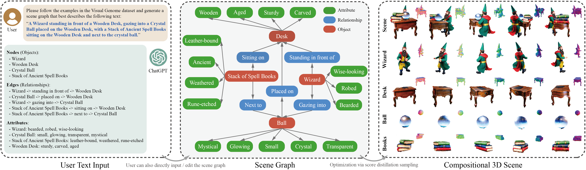

<!-- # GraphDreamer -->
# <p align="center">GraphDreamer: Compositional 3D Scene Synthesis from Scene Graphs </p>

####  <p align="center"> [Gege Gao](https://ggghsl.github.io/GGGWebsite/), [Weiyang Liu](https://wyliu.com/), [Anpei Chen](https://apchenstu.github.io/), [Andreas Geiger](https://www.cvlibs.net/), [Bernhard Schölkopf](https://is.mpg.de/~bs)</p>

### <p align="center">[Full Paper](https://arxiv.org/pdf/2312.00093.pdf) | [arXiv](https://arxiv.org/abs/2312.00093) | [Project Page](https://graphdreamer.github.io/)
 <!-- | [Video](https://www.youtube.com/watch?v=Xbzl4HzFiNo)</p> -->

<p align="center">
  
</p><p align="center">
  <b>GraphDreamer</b> takes scene graphs as input and generates object compositional 3D scenes.
</p>

# Code will be released soon!


## BibTex
```
@article{gao2023graphdreamer
  author    = {Gao, Gege and Liu, Weiyang and Chen, Anpei and Geiger, Andreas and Schölkopf, Bernhard},
  title     = {GraphDreamer: Compositional 3D Scene Synthesis from Scene Graphs},
  journal   = {arXiv},
  volume    = {2312.00093},
  year      = {2023},
}
```
