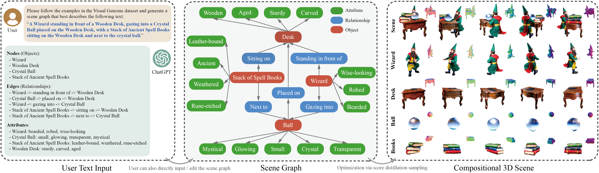

<!-- # GraphDreamer -->
# <p align="center">GraphDreamer: Compositional 3D Scene Synthesis from Scene Graphs </p>

###  <p align="center"> [Gege Gao](https://ggghsl.github.io/), [Weiyang Liu](https://wyliu.com/), [Anpei Chen](https://apchenstu.github.io/), [Andreas Geiger](https://www.cvlibs.net/), [Bernhard Schölkopf](https://is.mpg.de/~bs)</p>

###  <p align="center">CVPR 2024</p>

### <p align="center">[Full Paper](https://arxiv.org/pdf/2312.00093.pdf) | [arXiv](https://arxiv.org/abs/2312.00093) | [Project Page](https://graphdreamer.github.io/)

<p align="center">
  
</p><p align="center">
  <b>GraphDreamer</b> takes scene graphs as input and generates object compositional 3D scenes.
</p>

## News
- **[2026.06] [Follow-up Work](#follow-up-work-20242026-retrospective) retrospective added.** We added a small retrospective section summarizing representative follow-up and adjacent work after GraphDreamer, including optimization-based extensions, richer scene representations, and recent agentic 3D construction pipelines. 
<!-- See [Follow-up Work](#follow-up-work-20242026-retrospective). -->

## Abstract
This repository contains a pytorch implementation for the paper [GraphDreamer: Compositional 3D Scene Synthesis from Scene Graphs](https://arxiv.org/abs/2312.00093). Our work present the first framework capable of generating **compositional 3D scenes** from **scene graphs**, where objects are represented as nodes and their interactions as edges. See the demo bellow to get a general idea.


## Installation
#### Tested on CentOS 7.9 + Python 3.10.10 + Pytorch 2.0.1

```sh
git clone https://github.com/GGGHSL/GraphDreamer.git
cd GraphDreamer
```
Create environment:
```sh
python3.10 -m venv venv/GraphDreamer
source venv/GraphDreamer/bin/activate  # Repeat this step for every new terminal
```
Install dependencies:
```sh
pip install -r requirements.txt
```

Install [tiny-cuda-nn](https://github.com/NVlabs/tiny-cuda-nn) for running Hash Grid based representations:
```sh
pip install git+https://github.com/NVlabs/tiny-cuda-nn/#subdirectory=bindings/torch
```

Install [NerfAcc](https://github.com/nerfstudio-project/nerfacc) for NeRF acceleration:
```sh
pip install git+https://github.com/KAIR-BAIR/nerfacc.git
```

Guidance model [DeepFloyd IF](https://github.com/deep-floyd/IF?tab=readme-ov-file) currently requires to accept its usage conditions. To do so, you need to have a [Hugging Face account](https://huggingface.co/welcome) (login in the terminal by `huggingface-cli login`) and accept the license on the model card of [DeepFloyd/IF-I-XL-v1.0](https://huggingface.co/DeepFloyd/IF-I-XL-v1.0). 

## Quick Start
Generate a compositional scene of ```"a blue jay standing on a large basket of rainbow macarons"```:
```sh
bash scripts/blue_jay.sh
```
Results of the first (coarse) and the second (fine) stage will be save to ```examples/gd-if/blue_jay/``` and ```examples/gd-sd-refine/blue_jay/```. 

Try different seeds by setting ```seed=YOUR_SEED``` in the script. 
Use different tags to name different trials by setting ```export TG=YOUR_TAG``` to avoid overwriting. More examples can be found under ```scripts/```.

## Try with Your Own Prompts
Generating a compositional scene with GraphDreamer is as easy as with other dreamers. Here are the steps: 

#### Step 1 - Describe your objects
Give each object you want to create in the scene a prompt by setting
```sh
export P1=YOUR_TEXT_FOR_OBJECT_1
export P2=YOUR_TEXT_FOR_OBJECT_2
export P3=YOUR_TEXT_FOR_OBJECT_3
```
and ```system.prompt_obj=[["$P1"],["$P2"],["$P3"]]``` in the bash script .

By default, object SDFs will be initialized as spheres centered randomly, with the dispersion of the centers adjusted by multiplying a hyperparameter ```system.geometry.sdf_center_dispersion``` set to ```0.2```. 

#### Step 2 - Describe object relationships
Compose your objects into a scene by giving each object a prompt on its relationship to another object
```sh
export P12=RELATIONSHIP_BETWEEN_OBJECT_1_AND_2 
export P13=RELATIONSHIP_BETWEEN_OBJECT_1_AND_3
export P23=RELATIONSHIP_BETWEEN_OBJECT_2_AND_3
```
and add ```system.prompt_global=[["$P12"],["$P23"],["$P13"]]``` to your script. Based on these relationships, a graph is created accordingly with edges ```export E=[[0,1],[1,2],[0,2]]``` and ```system.edge_list=$E```.


Prompt the global scene by combining ```P12```, ```P13```, and ```P23``` into a sentence
```sh
export P=GLOBAL_TEXT_FOR_THE_SCENE
```
and add ```system.prompt_processor.prompt="$P"``` into the script. 


#### Step 3 - Negative prompts (optional)
In this compositional senarios, we found a simple way to create the "negative" prompt for individual objects. 
For each object, all other objects plus their relationships can be used as a negative prompt, 
```sh
export N1=$P23
export N2=$P13
export N3=$P12
```
and setting```system.prompt_obj_neg=[["$N1"],["$N2"],["$N3"]]```. 
You can further refine each negative prompts based on this general rule. 

#### Step 4 - Coarse-to-fine training
Start a new trainining simply by
```sh
export TG=YOUR_OWN_TAG
# Use different tags to avoid overwriting

python launch.py --config CONFIG_FILE --train --gpu 0 exp_root_dir="examples" system.geometry.num_objects=3 use_timestamp=false tag=$TG OTHER_CONFIGS
```
Set your own tag of the saving folder by ```export TG=YOUR_OWN_TAG``` and ```tag=$TG```, enable time stamps for naming the folder by setting```use_timestamp=true```.

The training configurations for the coarse stage are stored in ```configs/gd-if.yaml``` and the fine stage in ```configs/gd-sd-refine.yaml```. 

To resume from a previous checkpoint, e.g., resume from a coarse-stage training for the fine stage
```sh
resume=examples/gd-if/$TG/ckpts/last.ckpt
```


## More Applications
GraphDreamer can be used to inverse the semantics in a given image into a 3D scene, by extracting a scene graph directly from an input image with ChatGPT-4. 

To generate more objects and accelerate convergence, you may provide rough center coordinates for initializing each object by setting in the script:
```sh
export C=[[X1,Y1,Z1],[X2,Y2,Z3],...,[Xm,Ym,Zm]]
``` 
This will initialize the SDF-based objects as spheres centered at your given coordinates. The initial size of each object SDF sphere can also be custimized by setting the radius:
```sh
export R=[R1,R2,...,Rm]
```
Check ```./threestudio/models/geometry/gdreamer_implicit_sdf.py``` for more details on this implementation.

<!-- ## Code Structure
(TODO) -->

## Follow-up Work (2024–2026 Retrospective)

GraphDreamer appeared at CVPR 2024 as an early step toward structured text-to-3D scene generation. 
At a high level, its pipeline follows: user prompt → LLM-generated scene graph → natural-language object/relation/scene prompts → 2D diffusion SDS → 3D scene optimization. This makes decomposition explicit, but also leaves a central mismatch: the intermediate scene graph is structured, while the diffusion guidance remains an entangled natural-language signal.

Since then, the field of compositional 3D scene generation has moved quickly, from improving GraphDreamer-style optimization to exploring richer scene representations and agentic construction pipelines. This section summarizes representative follow-up and adjacent work for readers who want a compact roadmap of the area. It is not intended as a full survey; we focus on papers that either cite GraphDreamer as a baseline or address closely related problems in structured 3D scene generation, while omitting surveys, video/4D, avatar/HOI, and otherwise tangential directions.

A useful way to read the follow-up work is as a gradual shift from **static scene graphs**, to **richer scene languages**, and finally to **agentic 3D builders**.

#### 1. Fixing GraphDreamer-style optimization bottlenecks
The most direct follow-up work targets the practical limitations of GraphDreamer-style SDS optimization. Jointly optimizing all objects from scratch becomes unstable as scene complexity grows: per-object and per-edge SDS gradients can conflict, optimization becomes slow, and memory usage grows quickly beyond a few objects. Other work also replaces the implicit SDF-style scene representation with more object-centric or explicit representations to reduce entanglement and improve texture quality.
- [**DecompDreamer**](https://arxiv.org/abs/2503.11981) (Nath et al., 2025) — staged decomposed-optimization curriculum on 3D Gaussians; first establishes a structural scaffold via inter-object relations, then refines per-object detail.
- [**CompGS**](https://arxiv.org/abs/2410.20723) (Ge et al., CVPR 2025) — initializes 3D Gaussians entity-by-entity from 2D compositionality priors, then alternates entity-level and composition-level SDS with masked gradients and volume-adaptive scaling for small entities.
- [**DIScene**](https://cg.cs.tsinghua.edu.cn/papers/SIGASIA-2024-DIScene.pdf) (Li et al., SIGGRAPH Asia 2024) — per-object explicit mesh + surface-aligned Gaussians in canonical space, with object-aware rendering (pixel-level depth composition) for clean inter-object gradient separation.
- [**OOR**](https://arxiv.org/abs/2503.19914) (Baik et al., ICCV 2025) — score-based diffusion model directly over pairwise object-object relative pose and scale, with multi-object DAG extension using collision and inconsistency losses.

#### 2. From scene graphs to richer scene representations
A second line of work addresses the representational limits of using scene graphs plus natural-language prompts as the main control interface. While this representation is convenient and interpretable, it remains a coarse signal for complex 3D scenes: natural language is ambiguous as spatial supervision, per-object descriptions do not reliably preserve visual identity, and decomposed object/relation objectives can lose holistic coherence or physical plausibility. Later methods therefore introduce hybrid scene languages, executable programs, explicit layouts, causal graphs, coherence critics, and architectural priors to recover structure that is lost when a scene graph is flattened into text.

**Scene-graph + NL prompts are a coarse spatial signal:**
Outputs sometimes disregard specified object counts, exhibit the Janus problem, or blend object boundaries; per-object natural-language descriptions also cannot reliably encode visual identity.
- [**The Scene Language**](https://arxiv.org/abs/2410.16770) (Zhang et al., CVPR 2025 Highlight) — hybrid representation of programs + words + embeddings, where programs give exact structural layout and embeddings carry visual identity.
- [**SceneMotifCoder**](https://arxiv.org/abs/2408.02211) (Tam et al., 3DV 2025 Oral) — LLM-synthesized visual programs that compose retrieved 3D assets, sidestepping per-object SDS entirely.
- [**Layout-Your-3D**](https://arxiv.org/abs/2410.15391) (Zhou et al., ICLR 2025) — explicit 2D layout (user-drawn or LLM-generated) as a spatial blueprint, plus collision-aware optimization and per-instance refinement.

**Decomposition can break holistic coherence and physical plausibility:**
Per-object/per-edge SDS objectives sometimes yield implausible combinations, severe occlusions, or floating objects.
- [**CoherenDream**](https://arxiv.org/abs/2504.19860) (Jiang et al., 2025) — unified 3D representation with an MLLM critic providing text-coherence feedback inside the SDS loop, with LLM-generated 3D-bbox warm-up.
- [**CausalStruct**](https://arxiv.org/abs/2509.15249) (Chen et al., 2025) — LLM-built causal scene graph with causal-order + causal-intervention refinement, plus PID-controlled scale/position tuning from MLLM feedback, on a 3DGS+SDS backbone.

**Small tabletop-scale scenes do not cover architectural structure:**
GraphDreamer is mostly limited to a few-object composition setting (< 6 in general) and has no explicit representation for walls, doors, ceilings, rooms, or other architectural elements.
- [**SceneCraft**](https://arxiv.org/abs/2410.09049) (Yang et al., NeurIPS 2024) — accepts user-defined 3D bounding-box layouts for full multi-room indoor scenes, distilled into NeRF via a Stable Diffusion conditioned on per-view semantic + depth renderings of the layout.

#### 3. Agent as iterative 3D builder
A newer adjacent direction pushes the intermediate representation further: the agent is no longer only a one-shot parser from prompt to scene graph, but an iterative builder. These systems use LLM/VLM agents to plan, write executable programs, render intermediate results, inspect failures, maintain spatial or multimodal memory, and revise the scene over multiple steps. Many of these papers do not cite GraphDreamer directly, but they inherit a related idea: complex 3D generation benefits from an explicit structured layer between user intent and final geometry.

- [**Agentic3D**](https://arxiv.org/abs/2505.20129) (Liu, Tai, Tang, 2025) — equips a VLM agent with a continually updated spatial context, including a scene portrait, labeled point cloud, and scene hypergraph, enabling iterative 3D scene generation, editing, and spatial reasoning.
- [**VIGA**](https://arxiv.org/abs/2601.11109) (Yin et al., 2026) — an inverse-graphics agent that reconstructs or edits scenes through an interleaved code-render-inspect loop, using executable graphics programs, rendered feedback, and evolving multimodal memory.
- [**Code-as-Room**](https://arxiv.org/abs/2605.18451) (Yang et al., 2026) — an MLLM-based agentic framework that converts a top-down room image into executable Blender code, decomposing room generation into staged layout parsing (with render-and-compare refinement), object profiling, geometry, material, and lighting synthesis, with a cross-stage memory module to prevent context forgetting.


### Where the activity is

The main activity has shifted from simply making GraphDreamer-style SDS **more stable** toward asking what the **intermediate structure** should be. Early follow-up work focuses on optimization and object-level decomposition: how to scale beyond a few objects, avoid gradient conflict, and replace entangled implicit fields with more object-aware representations. The next wave moves beyond scene graphs written as natural language, using programs, layouts, causal graphs, hybrid embeddings, and coherence critics to provide more explicit structure. The newest agentic direction goes one step further: the intermediate structure is no longer only a static representation of the scene, but an executable and revisable construction process.

In this sense, GraphDreamer can be seen as an early step in a broader transition: from prompt-driven 3D generation, to structured scene representation, to agentic 3D construction.

## Acknowledgement
The authors extend their thanks to Zehao Yu and Stefano Esposito for their invaluable feedback on the initial draft. Our thanks also go to Yao Feng, Zhen Liu, Zeju Qiu, Yandong Wen, and Yuliang Xiu for their proofreading of the final draft and for their insightful suggestions which enhanced the quality of this paper. Additionally, we appreciate the assistance of those who participated in our user study. 

Weiyang Liu and Bernhard Sch\"olkopf was supported by the German Federal Ministry of Education and Research (BMBF): T\"ubingen AI Center, FKZ: 01IS18039B, and by the Machine Learning Cluster of Excellence, the German Research Foundation (DFG): SFB 1233, Robust Vision: Inference Principles and Neural Mechanisms, TP XX, project number: 276693517. Andreas Geiger and Anpei Chen were supported by the ERC Starting Grant LEGO-3D (850533) and the DFG EXC number 2064/1 - project number 390727645.

This codebase is developed upon [threestudio](https://github.com/threestudio-project/threestudio). We appreciate its maintainers for their significant contributions to the community.


## Citation
```
@Inproceedings{gao2024graphdreamer,
  author    = {Gege Gao, Weiyang Liu, Anpei Chen, Andreas Geiger, Bernhard Schölkopf},
  title     = {GraphDreamer: Compositional 3D Scene Synthesis from Scene Graphs},
  booktitle = {Conference on Computer Vision and Pattern Recognition (CVPR)},
  year      = {2024},
}
```
